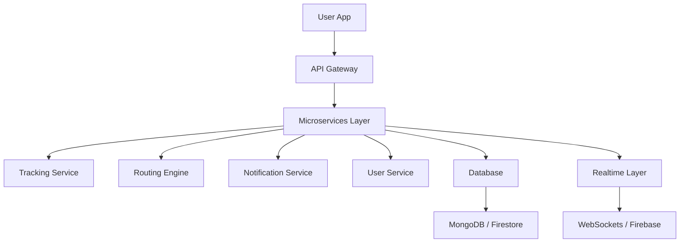

# 🚀 MoveSmart

**Intelligent Urban Mobility & Safety Platform**

<!-- 🎨 Animated Banner -->

<p align="center">
  
</p>

<h1 align="center">🚀 MoveSmart</h1>
<p align="center"><b>Smart • Safe • Scalable Urban Mobility</b></p>

<p align="center">
  
  
  
  
  
  
</p>

---

## 🌍 Overview

**MoveSmart** is a **next-generation urban mobility platform** designed to eliminate inefficiencies in modern transportation systems.

It combines **real-time tracking, intelligent routing, and safety-first infrastructure** into a single ecosystem — delivering a seamless commuting experience for **students, professionals, and late-night travelers**.

---

## 📌 Problem Statement

Urban mobility ecosystems—spanning school transportation, daily commuting, and late-night travel—operate with:

* ❌ Limited real-time visibility
* ❌ Inefficient routing strategies
* ❌ Fragmented safety infrastructure

These issues lead to:

* ⏳ Long commute times (often 90+ minutes)
* 🔍 Lack of transparency
* 🚨 Increased safety risks

---

## 💡 Solution

MoveSmart introduces a **data-driven mobility ecosystem** that provides:

* 📍 Live vehicle tracking
* 🧭 AI-powered route optimization
* 🔔 Real-time alerts
* 🛡️ Integrated safety system

> Result: **Faster, safer, and smarter commuting**

---

## 🧠 Core Features

### 📍 Real-Time Tracking

Accurate live tracking of vehicles with geolocation updates.

### 🧭 Smart Routing Engine

Dynamic route optimization using traffic data and predictive algorithms.

### 🛡️ Safety-First System

* 🚨 SOS Emergency Alerts
* 📡 Live Location Sharing
* 👨‍👩‍👧 Trusted Contacts
* 🌙 Night Travel Monitoring

### 🔔 Notification Engine

Instant updates for:

* Delays
* Arrivals
* Route changes

### 📊 Analytics Layer

Data insights to improve:

* Route planning
* Fleet efficiency
* User experience

---

## 🏗️ System Architecture



---

## 🛠️ Tech Stack

| Layer     | Technology              |
| --------- | ----------------------- |
| Frontend  | React.js, Flutter       |
| Backend   | Node.js, Express.js     |
| Database  | MongoDB, Firebase       |
| Real-Time | WebSockets, Firebase    |
| Cloud     | AWS / Firebase / Vercel |

---

## 🔌 APIs & Integrations

* 🌍 **Google Maps API** → Maps, routing, distance calculation
* 📡 **Firebase Realtime DB / Firestore API** → Live data sync
* 🔐 **Firebase Authentication API** → Secure login
* 📍 **Geolocation API** → Location tracking
* 🔔 **Firebase Cloud Messaging (FCM)** → Push notifications

---

## ⚙️ Getting Started

### 1️⃣ Clone Repository

```bash
git clone https://github.com/your-username/movesmart.git
cd movesmart
```

### 2️⃣ Install Dependencies

```bash
npm install
```

### 3️⃣ Environment Setup

Create `.env` file:

```
GOOGLE_MAPS_API_KEY=your_api_key
FIREBASE_API_KEY=your_api_key
MONGODB_URI=your_database_url
JWT_SECRET=your_secret
```

### 4️⃣ Run Project

```bash
npm start
```

---

## 📊 Usage

* 🚍 Track vehicles in real-time
* 🧭 Get optimized travel routes
* 🔔 Receive live notifications
* 🛡️ Use emergency safety features
* 📈 Monitor commute performance

---

## 📈 Future Roadmap

* 🤖 AI-based predictive routing
* 🚦 Smart traffic integration
* 📡 IoT-based vehicle tracking
* 🧠 ML-powered safety analytics
* 🌆 Multi-city scaling

---

## 🤝 Contribution

We welcome contributions 🚀

```bash
# Fork the repo
# Create a branch
git checkout -b feature/your-feature

# Commit changes
git commit -m "Added feature"

# Push
git push origin feature/your-feature
```

Then open a Pull Request ✅

---

## 🌟 Vision

To build a **smart, safe, and transparent mobility ecosystem** that transforms how cities move.

---

## 📬 Contact

📧 [maharshi.j.patel.cg@gmail.com](mailto:your-[maharshi.j.patel.cg@gmail.com](https://mail.google.com/mail/u/0/#inbox))

---

<!-- 🔥 Footer Animation -->

<p align="center">
  
</p>
